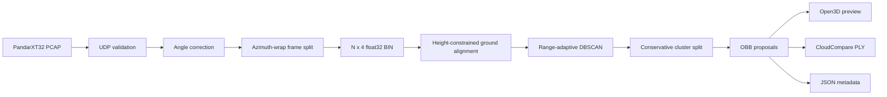

# Hesai XT32 LiDAR Processing Pipeline

[](https://github.com/huijiaguonian/lidar_data_processing/actions/workflows/ci.yml)


A compact, CPU-oriented pipeline that turns raw Hesai PandarXT32 packet captures into frame-separated point clouds and class-agnostic 3D object proposals.

> 中文概览：这是一个从 PandarXT32 UDP 数据解析出发的点云处理作品。主线覆盖 PCAP 解析、按旋转周期分帧、BIN/PLY 可视化、地面校正、距离自适应 DBSCAN 聚类和 OBB 几何框生成。项目诚实保留了方法边界：当前输出是几何候选框，不是语义车辆识别结果。


_Four real frames rendered with one fixed view and one unchanged parameter set. Orange rectangles are class-agnostic geometric proposals, not semantic labels._

## Work completed

The original goal was an end-to-end perception stack: data processing, learning, detection, tracking, and rendering. In practice, the most substantial engineering work was reliable sensor decoding and building a useful CPU-only geometric baseline.

The portfolio version focuses on the parts that are technically defensible and reproducible:

- validation and parsing of PandarXT protocol v6.1 packets;
- block-level azimuth handling and frame splitting at a real revolution boundary;
- distance scaling read from each packet header instead of hard-coded;
- a documented `N x 4` point-cloud interchange format;
- height-constrained multi-plane ground selection;
- range-adaptive density clustering and conservative OBB fitting;
- Open3D preview, CloudCompare-compatible PLY, and JSON export;
- reproducible rendering of real detection outputs for portfolio documentation;
- parser and detector regression tests plus a reproducible 20-frame stability audit.

The result is a complete unsupervised main project rather than an unfinished end-to-end claim. Real-frame artifacts and an evenly sampled 20-frame stability audit are documented in [docs/RESULTS.md](docs/RESULTS.md).

## Pipeline



## Project status

| Component | Status | Notes |
|---|---|---|
| PandarXT32 packet parser | Maintained | Protocol v6.1, 8 blocks x 32 channels |
| Revolution-based frame split | Maintained | Detects azimuth wrap inside a UDP packet |
| BIN/PLY visualization | Maintained | Windows Open3D and headless PLY export |
| Unsupervised OBB proposals | Prototype | Useful for exploration; scene-dependent recall |
| Semantic object recognition | Not claimed | No reliable target-domain labels |
| Tracking | Not implemented | Outside the final maintained scope |
| PointPillars/OpenPCDet path | Archived | Preserved as a patch and experiment scripts |

The stopped supervised route is still auditable: [legacy/supervised/README.md](legacy/supervised/README.md) links the exact PointPillars configuration, XT32 inference conversion, export scripts, upstream base commit, and complete OpenPCDet patch. It is evidence of the investigation, not the framework of this repository.

## Installation

Python 3.9 or newer is required. A clean virtual environment is recommended.

```powershell
git clone https://github.com/huijiaguonian/lidar_data_processing.git
cd lidar_data_processing
python -m venv .venv
.venv\Scripts\Activate.ps1
python -m pip install --upgrade pip
python -m pip install -e ".[all]"
```

Install only the lightweight parser dependencies with:

```powershell
python -m pip install -e ".[pcap]"
```

## Quick start

### 1. Parse PCAP into frames

```powershell
hesai-xt32-parse `
  --pcap path\to\capture.pcap `
  --angle path\to\PandarXT_Angle.csv `
  --outdir outputs\frames
```

The angle-correction CSV must contain 32 channels and the columns `Channel`, `Elevation`, and `Azimuth`.

### 2. Inspect or convert one frame

```powershell
hesai-xt32-view `
  --bin outputs\frames\frame_0001.bin
```

For CloudCompare or a machine without a working OpenGL window:

```powershell
hesai-xt32-view `
  --bin outputs\frames\frame_0001.bin `
  --save-ply outputs\frame_0001_colored.ply `
  --no-view
```

### 3. Generate geometric proposals

```powershell
hesai-xt32-detect `
  --bin outputs\frames\frame_0001.bin `
  --outdir outputs\detections\frame_0001 `
  --no-view
```

The output directory contains:

- `environment_aligned.ply` - the ground-aligned environment cloud;
- `non_ground_roi.ply` - non-ground points inside the configured ROI;
- `detected_obbs.ply` - OBB line geometry for CloudCompare;
- `detections.json` - proposal center, dimensions, angle, range, and cluster metadata.

### 4. Try a synthetic frame

No recorded sensor data is committed to this repository. Generate a deterministic example instead:

```powershell
python examples\generate_synthetic_frame.py
hesai-xt32-detect --bin outputs\examples\synthetic_frame.bin --no-view
```

## The distance-unit issue

The parser does **not** assume one universal scale. PandarXT stores `Dis Unit` in the UDP data header and the parser converts it from millimetres to metres:

```text
raw 0x01 -> 0.001 m
raw 0x04 -> 0.004 m
```

The recorded data used during this project was visually verified with a `0.001 m` unit. Earlier code hard-coded `0.004 m`, which distorted the scene. Reading the header keeps the parser correct for both packet variants. See [docs/DATA_FORMAT.md](docs/DATA_FORMAT.md) for the byte layout.

## Repository layout

```text
src/hesai_xt32/     maintained Python package and CLI entry points
tests/              parser and detector regression tests
examples/           synthetic data generator and usage notes
scripts/            asset renderer and sequence-stability audit
docs/               architecture, formats, results, and retrospective
legacy/             archived experiments; not part of the supported API
```

The full OpenPCDet source tree is intentionally not vendored. The archived supervised-learning changes are stored as a patch with their upstream base commit and license information under `legacy/`.

## Method and limitations

The detector extracts several seeded RANSAC planes and selects a ground candidate whose tilt and distance agree with the 1.20 m sensor-height prior. It then rotates the selected plane to `+Z`, removes ground inliers, applies a 3D ROI, downsamples the remaining points, and runs DBSCAN in overlapping radial bands. Candidate clusters are conservatively split only when a clear physical gap is present, then fitted with a minimum-area 2D rectangle and a 3D height range.

This design favors fewer false positives over maximum recall. It still has important limitations:

- proposals have no semantic class label;
- sparse distant vehicles may be missed;
- touching vehicles may remain merged;
- poles or compact structures can resemble distant targets;
- strongly non-planar terrain can invalidate the ground assumption;
- quantitative precision and recall require target-domain annotations.

See [docs/ARCHITECTURE.md](docs/ARCHITECTURE.md) for implementation details, [docs/RESULTS.md](docs/RESULTS.md) for real-frame examples, and [docs/RETROSPECTIVE.md](docs/RETROSPECTIVE.md) for the project decisions and lessons learned.

## Attribution and licensing

The maintained CPU pipeline is independent of OpenPCDet at runtime. Historical supervised experiments were based on OpenPCDet and are retained only in `legacy/supervised/`; their upstream attribution and Apache 2.0 license are documented in `legacy/openpcdet/`.

No license has yet been selected for the original code in this portfolio repository.
