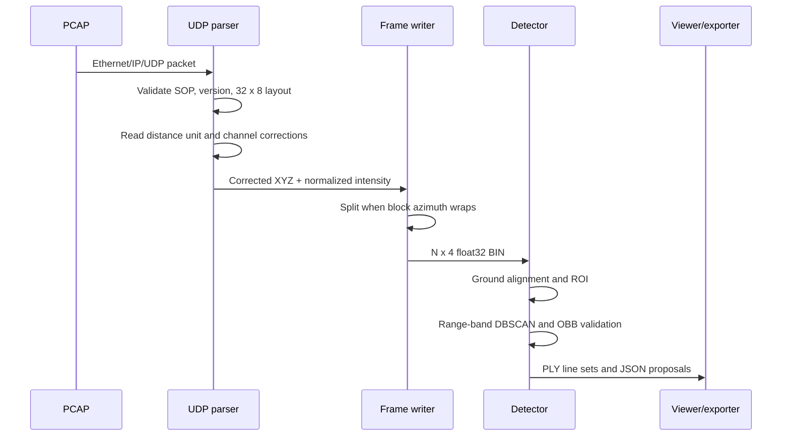

# Architecture

## Maintained boundary

The supported project is deliberately smaller than the original end-to-end idea.

| Module | Responsibility | Heavy dependency |
|---|---|---|
| `hesai_xt32.parse_pcap` | Validate UDP payloads, apply channel corrections, split revolutions, write BIN | Scapy only for PCAP I/O |
| `hesai_xt32.visualize_bin` | Validate BIN, color by height or intensity, preview or export PLY | Open3D, Matplotlib |
| `hesai_xt32.detect_unsupervised` | Ground alignment, adaptive clustering, OBB proposal generation | Open3D, scikit-learn, OpenCV |

Everything under `legacy/` is evidence of the development path, not a supported API.

## Data flow

## Coordinate convention

The parser follows the PandarXT convention used in the captured packets:

- azimuth 0 degrees points along `+Y`;
- `+X` is lateral;
- `+Z` is upward;
- intensity is normalized from an unsigned byte to `[0, 1]`.

This differs from the KITTI/OpenPCDet convention, where `+X` is normally forward. The archived supervised experiment contains the explicit coordinate conversion that was tested at the time.

## Frame boundary

An XT32 packet contains eight azimuth blocks. A revolution can wrap inside a packet, so frame splitting is performed for every block rather than once per packet. A drop greater than 180 degrees is treated as a wrap; smaller backwards changes are treated as jitter.

## Detector design

The detector is geometry-only:

1. Reject invalid values and points outside the radial range.
2. Fit the dominant ground plane with seeded RANSAC.
3. Reject a dominant plane whose tilt suggests a wall.
4. Rotate the cloud so the ground normal becomes `+Z`.
5. Remove ground inliers and apply a 3D region of interest.
6. Voxel-downsample the remaining points.
7. Run DBSCAN in overlapping radial bands with looser settings at distance.
8. Merge clusters that share points in overlapping bands.
9. Split oversized clusters only across a clear physical gap.
10. Fit and validate a minimum-area rectangle plus vertical extent.

The thresholds currently live near the top of `detect_unsupervised.py`. They are intentionally visible because this is a research prototype, not a trained universal detector.

## Failure behavior

The maintained commands fail early for:

- an invalid SOP or protocol version;
- a channel/block count other than 32 x 8;
- a zero or truncated distance unit header;
- an angle CSV that is not exactly 32 ordered channels;
- malformed `N x 4` BIN files;
- too few points for a credible ground estimate;
- a dominant plane that is probably a wall.
