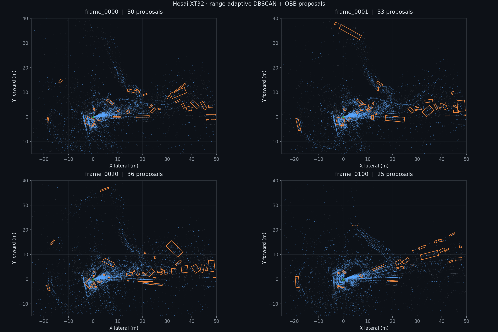
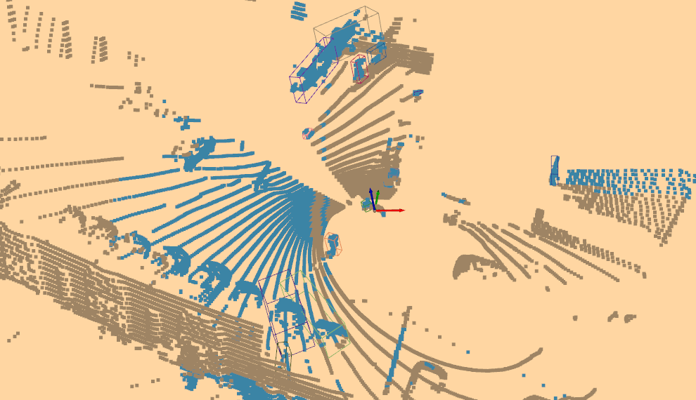

# Qualitative results

## Scope

These assets were produced from four real PandarXT32 frames with the same maintained detector and the same parameter set. They demonstrate repeatability of the processing path; they are not an accuracy benchmark because the capture has no ground-truth 3D boxes.



| Frame | Aligned environment points | Non-ground ROI points | Geometric proposals |
|---|---:|---:|---:|
| `frame_0000` | 30,964 | 8,732 | 30 |
| `frame_0001` | 32,654 | 10,546 | 33 |
| `frame_0020` | 33,062 | 9,786 | 36 |
| `frame_0100` | 40,997 | 10,332 | 25 |

Individual bird's-eye-view frames:

- [frame 0000](assets/demo/frame_0000.png)
- [frame 0001](assets/demo/frame_0001.png)
- [frame 0020](assets/demo/frame_0020.png)
- [frame 0100](assets/demo/frame_0100.png)

An Open3D perspective captured during qualitative inspection is retained below:



## How the assets were generated

The detector outputs aligned environment PLY, non-ground ROI PLY, OBB line geometry, and JSON metadata. The repository renderer projects those saved artifacts into a fixed bird's-eye view:

```powershell
python scripts\render_detection_assets.py `
  path\to\frame_0000 `
  path\to\frame_0001 `
  path\to\frame_0020 `
  path\to\frame_0100
```

The underlying PCAP and BIN data are intentionally excluded because of size. The PNG files and [summary.json](assets/demo/summary.json) provide a compact, traceable record of these runs.

## Interpretation

The strongest result is not a semantic class score. It is a stable engineering chain from raw packet layout to inspectable geometric proposals:

- packet validation and correct scale;
- block-level revolution splitting;
- coordinate correction and ground alignment;
- density adaptation with range;
- conservative OBB construction;
- portable outputs for Open3D and CloudCompare.

Some visible objects remain missed and some small structures remain plausible proposals. Without annotations, proposal count must not be interpreted as object count, recall, or precision.
